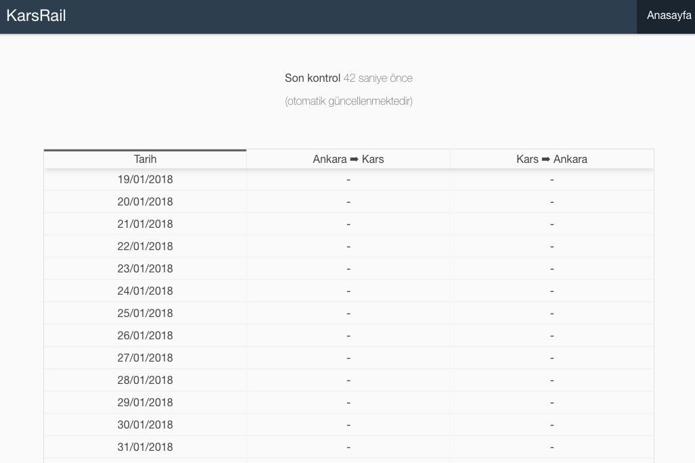

# DayimKonduktor Web
[](http://karsrail.batuhan.org)

## CLI Commands

``` bash
# install dependencies
npm install

# serve with hot reload at localhost:8080
npm run dev

# build for production with minification
npm run build

# test the production build locally
npm run serve

# deploy to surge.sh
npm run deploy
```

## Links

[Demo webpage](http://karsrail.batuhan.org/)

[DayimKonduktor cron script](https://github.com/BatuhanK/DayimKonduktor_cron)
